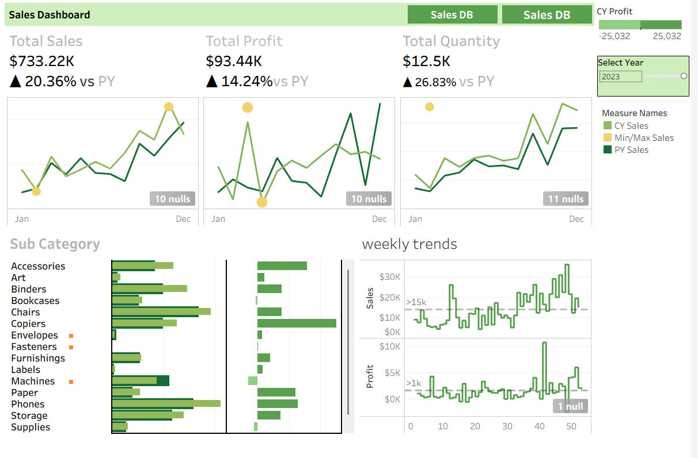

# Tableau Project

## 📊 Project Overview
This project is an interactive dashboard created using **Tableau** to analyze and visualize data insights effectively.

## 🛠 Tools Used
- Tableau
- Excel (Data Source)

## 📈 Dashboard Preview
Below is a snapshot of the Tableau dashboard:



## 🔍 Key Insights
- Trend analysis based on the dataset
- Category-wise comparison
- Visual representation of key metrics

## 📁 Files in this Repository
```text
tableau Project.twbx  -> Tableau Packaged Workbook
Tableau.png           -> Dashboard Screenshot
README.md             -> Project Documentation
